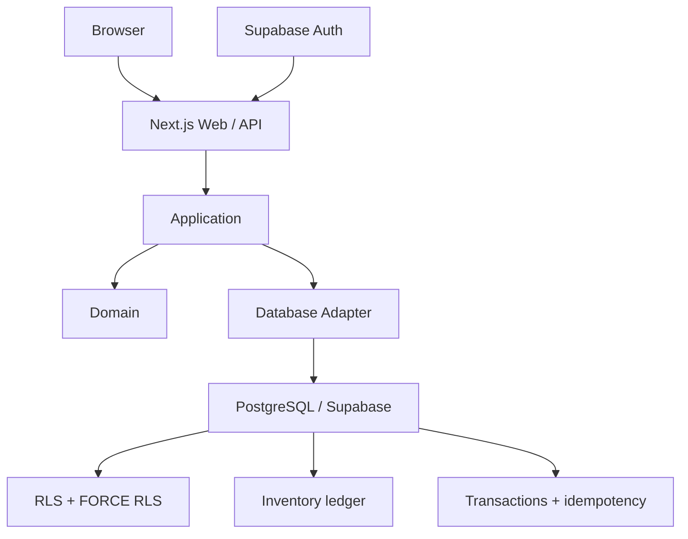
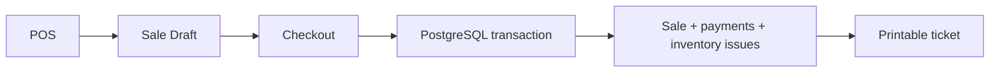

# SmartRetail


Sistema de gestion para tiendas con catalogo, inventario multiubicacion, punto de venta, caja, ventas, tickets, codigos de barras y ventas suspendidas.

## Demo

[app.smartretailapp.live](https://app.smartretailapp.live) es la aplicacion web productiva. El dominio raiz queda reservado para la marca y una futura landing. No se publican credenciales de acceso.

## Funciones actuales

- Autenticacion, multi-tenant, roles y permisos
- Productos, SKU y barcode
- Inventario por ubicacion: recepciones, salidas, ajustes, conteos fisicos y transferencias
- POS con efectivo, tarjeta y pago mixto
- Caja, turnos y conciliacion
- Historial de ventas y ticket imprimible
- Lookup y escaneo por barcode
- Ventas suspendidas
- Devoluciones parciales/totales y reembolsos contables (TASK-019)

## Arquitectura



Flujo resumido de venta:



## Seguridad

La aplicacion verifica JWT server-side, membership por tenant y permisos por accion. PostgreSQL usa RLS y FORCE RLS con un rol de base de datos restringido; las operaciones comerciales se ejecutan en transacciones con idempotencia durable y ledger de inventario. La interfaz aplica controles same-origin/CSRF donde corresponde. El proyecto mantiene auditoria de dependencias y configuracion Gitleaks. Estas medidas no constituyen una afirmacion de seguridad absoluta: los limites y riesgos conocidos estan documentados en [SECURITY](docs/SECURITY.md).

## Stack

Versiones tomadas de los manifests actuales:

- Node.js `>=24.13.1 <25` y pnpm `11.27.1`
- Next.js `16.3.6`, React `19.3.0`, TypeScript `6.0.3`
- Expo `57.0.24`, React Native `0.86.3`, React `19.2.3`
- Supabase JS `2.117.2` y `@supabase/ssr` `0.12.7`
- Vitest `5.0.1`, ESLint `9.39.5`, Prettier `3.9.9`
- PostgreSQL mediante el adaptador del paquete `database`; las pruebas locales documentadas usan PostgreSQL `18.6`
- Despliegue web en Vercel

## Estructura

```text
apps/web             Aplicacion Next.js web/API
apps/mobile          Base Expo para iOS y Android
packages/domain      Reglas de dominio puras
packages/contracts   Contratos y validacion
packages/application Casos de uso y puertos
packages/database    Adaptador PostgreSQL y transacciones
docs                  Arquitectura, seguridad y estado
```

## Desarrollo local

Requisitos: Node.js `24.13.1`, pnpm `11.27.1` y una base PostgreSQL de desarrollo cuando se ejecuten las pruebas de integracion.

```powershell
corepack pnpm install --frozen-lockfile
corepack pnpm check
corepack pnpm test:integration:required
corepack pnpm --filter @smartretail/web dev
corepack pnpm --filter @smartretail/web build
```

`test:integration:required` exige `SMARTRETAIL_PG_TEST_CONFIG` y falla si no existe la base PostgreSQL desechable; `pnpm test` puede omitir esas pruebas en desarrollo. La app web usa Next.js y la app movil requiere Expo. Las migraciones y los datos de desarrollo deben ser sinteticos y mantenerse fuera de produccion.

## Variables de entorno

Nombres confirmados en el codigo y en `apps/web/.env.example`:

```text
NEXT_PUBLIC_SUPABASE_URL
NEXT_PUBLIC_SUPABASE_PUBLISHABLE_KEY
DATABASE_URL
```

Las dos variables `NEXT_PUBLIC_` contienen configuracion publica de Auth. `DATABASE_URL` es exclusivamente server-side. Usa `.env.local` sin versionarlo; nunca sustituyas los placeholders del ejemplo con credenciales reales en un commit.

## Estado

- Web productiva desplegada en Vercel.
- Base movil existente, aun no publicada.
- TASK-019, devoluciones: `WIP / incompleta`.
- El HIGH temporal de `node-forge` de TASK-015A permanece aceptado y documentado; vence el `2026-11-02` y no se declara resuelto.

## Historial y documentacion

- [Historial del proyecto](docs/PROJECT_HISTORY.md)
- [Arquitectura](docs/ARCHITECTURE.md)
- [Seguridad](docs/SECURITY.md)
- [Decisiones tecnicas](docs/TECH_DECISIONS.md)
- [Despliegue](docs/DEPLOYMENT.md)
- [Estado del proyecto](docs/PROJECT_STATE.md)
- [E2E y auditoría visual UX](docs/E2E.md)

## Publicacion y secretos

El repositorio excluye entornos reales, dependencias, caches y artefactos de build mediante `.gitignore`. Antes de publicar cambios, ejecuta el escaneo Gitleaks configurado y revisa el contenido staged. No se incluyen tokens, contrasenas, cookies, JWT, claves privadas, dumps ni credenciales de fixtures.
