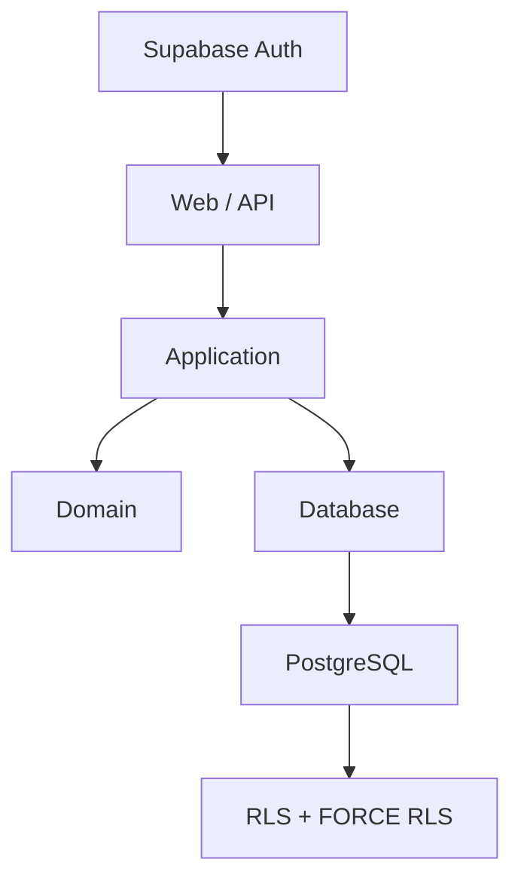
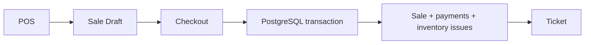

# Historial de SmartRetail

Este resumen reconstruye la evolucion real a partir de `PROJECT_STATE.md`, `TECH_DECISIONS.md` y los archivos del repositorio. No representa commits historicos: el proyecto se publica con un historial Git nuevo y honesto.

## Hitos

| Tarea | Estado | Resultado principal |
| --- | --- | --- |
| TASK-001 | ✅ Completada | Auditoria inicial, protocolo y documentacion base. |
| TASK-002 | ✅ Completada | Arquitectura propuesta, seguridad, decisiones tecnicas y limites. |
| TASK-003 / 003A | ✅ Completada | Git, workspace monorepo y pnpm 11.27.1 con lockfile reproducible. |
| TASK-004 | ✅ Completada | Base web Next.js con health endpoint, typecheck y build. |
| TASK-005 / 005A | ✅ Completada | Base movil Expo para iOS/Android e higiene de dependencias. |
| TASK-006A / 006B | ✅ Completada | Calidad, seguridad, ESLint, Prettier y primera suite Vitest. |
| TASK-007A | ✅ Completada | Money, contratos base y UUID con aritmetica exacta. |
| TASK-007B | ✅ Completada | Quantity y Unit con limites y conversiones explicitas. |
| TASK-007C / 007D | ✅ Completada | Product, validacion, edicion segura e invariantes de ciclo de vida. |
| TASK-008A | ✅ Completada | Ubicaciones y saldos de inventario. |
| TASK-008B | ✅ Completada | Movimientos de inventario y aplicacion exacta sobre saldos. |
| TASK-008C | ✅ Completada | Transferencias entre ubicaciones. |
| TASK-009 | ✅ Completada | Application layer y reconciliacion de conteos fisicos. |
| TASK-010 | ✅ Completada | PostgreSQL, RLS, transacciones e idempotencia durable. |
| TASK-011 | ✅ Completada | Memberships, tenancy, roles y permisos por accion. |
| TASK-012 / 012A | 🚀 Produccion | Supabase Auth, API/UI de productos y Gitleaks reproducible. |
| TASK-013 | 🚀 Produccion | Inventario web end-to-end y operaciones por ubicacion. |
| TASK-014 / 014B / 014C | 🚀 Produccion | Supabase Cloud, Vercel, smoke remoto y owner productivo. |
| TASK-015 / 015A | ⚠️ Riesgo documentado | Sale core, carrito POS y gate temporal por HIGH de node-forge. |
| TASK-016 | 🚀 Produccion | Checkout transaccional, pagos cash/card/mixto, ventas y POS. |
| TASK-017 | 🚀 Produccion | Caja, turnos, cierres, historial y ticket imprimible. |
| TASK-018 | 🚀 Produccion | Barcode, lookup, ventas suspendidas y recuperacion idempotente. El login habitual con email/password fue verificado posteriormente mediante logout real y acceso a Productos, Inventario y POS. |
| TASK-019 | 🚧 WIP | Devoluciones: existen piezas locales relacionadas, pero la tarea quedo incompleta y no se declara terminada. |

## Arquitectura en produccion

## Flujo de venta

## Lectura del estado actual

La web esta desplegada en `https://smartretail-sepia.vercel.app`. La app movil es una base Expo existente, pero no se presenta como publicada. El HIGH temporal aceptado en TASK-015A sigue documentado y vence el `2026-11-02`; el cierre del riesgo no forma parte de esta publicacion. TASK-019 permanece literalmente `WIP / incompleta`, sin continuar su desarrollo ni afirmar validaciones que no existen.
